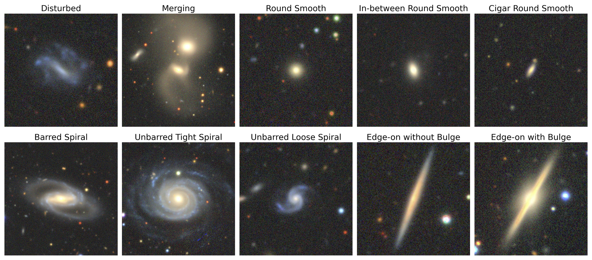
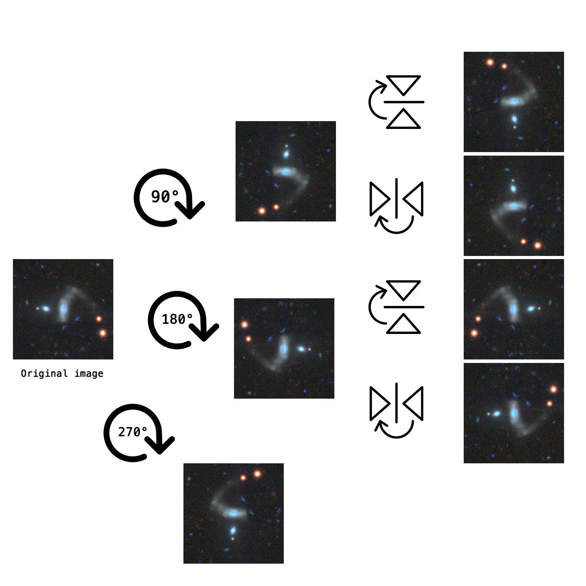
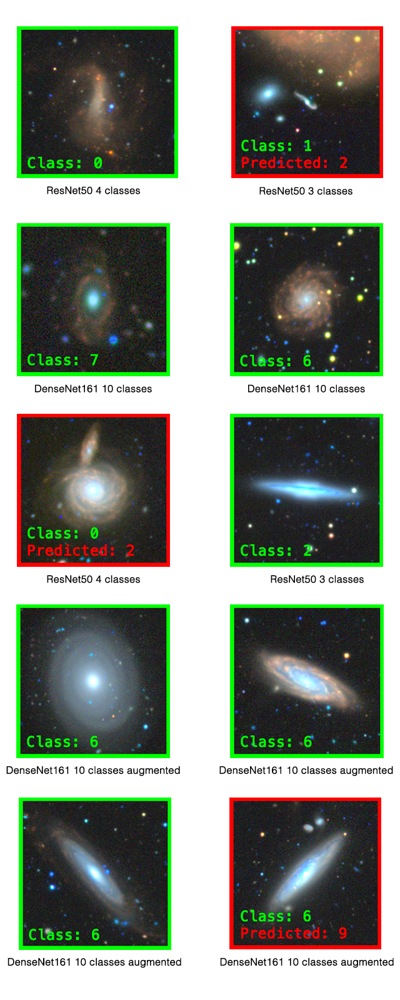

# Galaxy Morphology Classification
Galaxy10DECaLS classification using handcrafted feature extraction with machine learning and data augmentation with Focal Loss on deep learning process in order to improve F1 score.

  

# Requirements

- Python 3.x
- OpenCV 4.5.5.62
- PyTorch 0.14.1

# Dataset

The dataset is divided in 10 classes:

**Galaxy10 dataset (17733 images)**
- Class 0 (1081 images): Disturbed Galaxies
- Class 1 (1853 images): Merging Galaxies
- Class 2 (2645 images): Round Smooth Galaxies
- Class 3 (2027 images): In-between Round Smooth Galaxies
- Class 4 ( 334 images): Cigar Shaped Smooth Galaxies
- Class 5 (2043 images): Barred Spiral Galaxies
- Class 6 (1828 images): Unbarred Tight Spiral Galaxies
- Class 7 (2627 images): Unbarred Loose Spiral Galaxies
- Class 8 (1422 images): Edge-on Galaxies without Bulge
- Class 9 (1873 images): Edge-on Galaxies with Bulge

The 10 classes were merged into the following 4:

**Galaxy10 dataset (17733 images)**
- Class 0 (2934 images): Disturbed Galaxies + Merging Galaxies
- Class 1 (5006 images): Round Smooth Galaxies + In-between Round Smooth Galaxies + Cigar Shaped Smooth Galaxies
- Class 2 (6498 images): Barred Spiral Galaxies + Unbarred Tight Spiral Galaxies + Unbarred Loose Spiral Galaxies
- Class 3 (3295 images): Edge-on Galaxies without Bulge + Edge-on Galaxies with Bulge

Due to neural network confusion, Class 0 on 4 classes is deleted:

**Galaxy10 dataset (14799 images)**
- Class 0 (5006 images): Round Smooth Galaxies + In-between Round Smooth Galaxies + Cigar Shaped Smooth Galaxies
- Class 1 (6498 images): Barred Spiral Galaxies + Unbarred Tight Spiral Galaxies + Unbarred Loose Spiral Galaxies
- Class 2 (3295 images): Edge-on Galaxies without Bulge + Edge-on Galaxies with Bulge

The images have been extracted from an .h5 file following this [tutorial](https://astronn.readthedocs.io/en/latest/galaxy10.html)

The images (named with progressive index Galaxy10_DECals-dataset-*index padded to 5 digist*.png) and the labels where saved on a .csv file

Images from the .h5 file where 17736, but three of that are black, with index:

    11492
    12659
    15422

They have been removed from the images folder and from the .csv files of the splits and features.

Since the dataset accesses the images based on the index, in order to avoid mismatch between the image number and the index, all images were renamed via the rename-images.sh script.

# File organization

### AIA
- **dataset_extraction.py** - Extract images and labels from the .h5 file downloaded from [Galaxy10](https://astronn.readthedocs.io/en/latest/galaxy10.html).
- **handcrafted_feature_extraction.py** - Extract features using image analysis techniques.

### ML
- **features/**
  - `cnn-features-merged.csv` - ResNet50 features on 4 classes (DELETED).
  - `cnn-features.csv` - ResNet50 features on 10 classes (DELETED).
  - `features_merged.csv` - Handcrafted features on 4 classes.
  - `features.csv` - Handcrafted features on 10 classes.
- **main.ipynb** - Starting point of the ML project.
- **scores/** - Classification scores on test set.
- **results/** - Results of experiments.

### DL
- **dataset/**
  - **annotations/**
    - `all-3-augmented.csv` - 3 classes with data augmentation.
    - `all-3.csv` - 3 classes.
    - `all-4-augmented.csv` - 4 classes with data augmentation.
    - `all-4.csv` - 4 classes.
    - `all-10-augmented.csv` - 10 classes with data augmentation.
    - `all-10.csv` - 10 classes.
    - `debug-all-4.csv` - Debug annotations for 4 classes.
    - `debug-all-10.csv` - Debug annotations for 10 classes.
    - `filename-list.txt` - List of image filenames.
    - `statistics.csv` - Mean and std for each image channel.
  - **augmented/** - Data augmentation images (DELETED).
  - **data_augmentation.py** - Data augmentation code.
  - **Galaxy10_DECals.h5** - Original .h5 file (DELETED).
  - **image-removed/** - Debug folder for removed images.
    - `all-merged-no-rename-after-removing.csv`
    - `all-no-rename-after-removing.csv`
    - `Galaxy10_DECals-dataset-11492.png`
    - `Galaxy10_DECals-dataset-12659.png`
    - `Galaxy10_DECals-dataset-15422.png`
  - **images-3/** - Images for 3 class problem (DELETED).
  - **images-3-augmented/** - Augmented images for 3 classes (DELETED).
  - **images-10-4/** - Images for 10 and 4 classes (DELETED).
  - **images-10-4-augmented/** - Augmented images for 10 and 4 classes (DELETED).
  - **rename-images.sh** - Script to rename images if removed.
- **experiments/**
  - `*experiment_ID*/` - Folder for each experiment identified by its ID.
    - `debug-training/` - Debug files for training.
    - `debug-validation/` - Debug files for validation.
    - `errors.csv` - Wrongly classified images.
    - `plot/` - Graphs:
      - `f1.png`, `loss.png`, `train-validation-accuracy.png`
    - `*experiment_ID*.csv` - Experiment parameters.
    - `*experiment_ID*.tar` - Best model.
    - `resume/` - Resume graphs.
    - `test-metrics.csv` - Test metrics.
    - `test-scores.csv` - Test scores.
- **main.py** - Main file to start the code.
- **net/**
  - **dataset/**
    - `dataset_split.py` - Split dataset into train, validation, and test.
    - `dataset_statistics.py` - Extract dataset statistics.
    - `dataset_trasform.py` - Apply dataset transforms.
    - `dataset.py` - Dataset overload class.
    - **transforms/**
      - `MinMaxNormalization.py`, `StandardNormalization.py`, `ToTensor.py`
  - **evaluation/**
    - `metrics.py` - Evaluation metrics.
    - `plot.py` - Plot functions.
    - `save.py` - Functions to save .csv files.
  - **model/**
    - `feature_extraction.py` - Extract CNN model features.
    - `model_selector.py` - Select model to train.
  - **reproducibility/**
    - `reproducibility.py` - Set experiment reproducibility.
  - `test.py` - Test function.
  - `train.py` - Train function.

 

# Data split and class merging

The split is made handcrafted dividing the data in 50% training, 20% validation and 30% test.

### On 10 classes:

Dataset shape        | 17733 elements    |
---------------------|-------------------|
Training set length  | 8876              |
Validation set length| 3552              |
Test set length      | 5305              |

Class | Train | Validation | Test |
------|-------|------------|------|
  0   |  539  |    216     | 326  |
  1   |  927  |    372     | 554  |
  2   |  1323 |    530     | 792  |
  3   |  1015 |    405     | 607  |
  4   |  168  |    67      | 99   |
  5   |  1023 |    409     | 611  |
  6   |  916  |    367     | 545  |
  7   |  1314 |    526     | 787  |
  8   |  713  |    285     | 424  |
  9   |  938  |    375     | 560  |

 

### On 4 classes:

Dataset shape        | 17733 elements    |
---------------------|-------------------|
Training set length  | 8869              |
Validation set length| 3547              |
Test set length      | 5317              |

Class | Train | Validation | Test |
------|-------|------------|------
  0   |  1466 |    587     | 881  |
  1   |  2504 |    1001    | 1501 |
  2   |  3250 |    1300    | 1948 |
  3   |  1649 |    659     | 987  |

 

### On 3 classes:

Dataset shape        | 14799 elements    |
---------------------|-------------------|
Training set length  | 7403              |
Validation set length| 2960              |
Test set length      | 4436              |

Class | Train | Validation | Test |
------|-------|------------|------|
  0   |  2504 |    1001    | 1501 |
  1   |  3250 |    1300    | 1948 |
  2   |  1649 |    659     | 987  |

 

# Data augmentation

A data augmentation process is done with flipping and mirroring operations:

### On the 10 classes:

- Class 4: + 1001 images from 17733 to 18733
- Class 0: + 406 images from 18734 to 19139

All the indexes to reproduce the data augmentation from the original dataset are in the comments of *DL/dataset/data_augmentation.py*

Dataset shape        | 19140 elements    |
---------------------|-------------------|
Training set length  | 9680              |
Validation set length| 3753              |
Test set length      | 5707              |

Class | Train | Validation | Test |
------|-------|------------|------
  0   |  771  |    274     | 442  |
  1   |  927  |    372     | 554  |
  2   |  1323 |    530     | 792  |
  3   |  1015 |    405     | 607  |
  4   |  740  |    210     | 385  |
  5   |  1023 |    409     | 611  |
  6   |  916  |    367     | 545  |
  7   |  1314 |    526     | 787  |
  8   |  713  |    285     | 424  |
  9   |  938  |    375     | 560  |

Thus, we get the *all-10-augmented.csv*. 

### On 4 classes:

In order to get the *all-4-augmented.csv* from *all-10-augmented.csv*:

- Class 1 becomes 0 (here fall the class 0 on 10 classes augmented)
- Class 2, 3, 4 become 1 (here fall the class 4 on 10 classes augmented)
- Class 5, 6, 7 become 2
- Class 8, 9 become 3

Dataset shape        | 19140 elements    |
---------------------|-------------------|
Training set length  | 9680              |
Validation set length| 3753              |
Test set length      | 5707              |

Class | Train | Validation | Test |
------|-------|------------|------|
  0   |  1698 |    646     | 996  |
  1   |  3078 |    1145    | 1784 |
  2   |  3253 |    1302    | 1943 |
  3   |  1651 |    660     | 984  |

Thus, we get the *all-4-augmented.csv*. 

### On 3 classes:

In order to get the *all-3-augmented.csv* from *all-4-augmented.csv*: Class 0 on 10 classes is included in Class 0 on 4 classes. So, if it is removed, respect of the *all-3.csv* not augmented, we get the 1001 samples more of class 4, which falls into Class 1 on 4 classes, which became Class 0 on 3 classes. Finally, the new *all-3-augmented.csv* has 14799 + 1001 = 15800.

Images of Class 0 in 4 classes have to be removed. We remove images from 00000 to 02933 and also the images of Class 0 on 10 classes added with the augmentation: images from 18734 to 19139

Dataset shape        | 15800 elements    |
---------------------|-------------------|
Training set length  | 7982              |
Validation set length| 3107              |
Test set length      | 4711              |

Class | Train | Validation | Test |
------|-------|------------|------|
  0   |  3078 |    1145    | 1784 |
  1   |  3253 |    1302    | 1943 |
  2   |  1651 |    660     | 984  |

 

# How to launch it

The code can be launched by argument parsing:

    python3 main.py
    --file (all-10.csv, all-4.csv ecc...)
    --model (several models are implemented: resnet18, resnet34, resnet50, resnet101, resnet152, vgg11, vgg13, vgg16, vgg19, densenet121, densenet161, densenet169, densenet201)
    --bs (batch size)
    --ep (number of epochs)
    --lr (learning rate)
    --ss (step size)
    --gamma (gamma)
    --m (momentum)
    --opt (different optimizer are implemented: sgd, rms, adam)
    --loss (ce for cross entropy, f for focal loss)
    --test (include it to perform test, otherwise if not specified, the code perform training)
    --statistics (to evaluate statistics and save it in statistics.csv)
    --dataset (select the name of the dataset chosen according to the annotation file: images-10-4/images-10-4-augmented or images-3/images-3-augmented)

Example of launching configuration:

    python3 main.py --file all-10-augmented.csv --model resnet50 --bs 20 --ep 2 --lr 1e-4 --ss 1 --gamma 0.1 --m 0.9 --opt adam --dataset images-10-4-augmented --loss f --test --statistics

After launching the code, it will create a folder, named with the experiment identifier, in the experiments folder. Here all the debug files and results are stored, as shown in the project description. So, the experiment identifier is the key used to refer to a specific experiment

Example of classifications:

